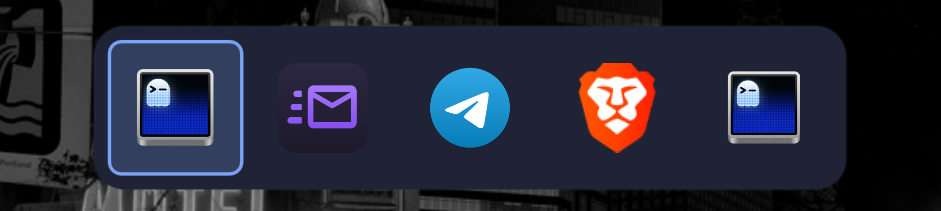

# Dank Switcher
maintained by: @hkdb

GNOME-style window switcher for [DankMaterialShell](https://github.com/AvengeMedia/DankMaterialShell) on Hyprland.



Hold **Super**, tap **Tab** to cycle through every window on every workspace (most-recently-used order, starting on the previous window), release **Super** to focus the selected one. A quick Super+Tab tap jumps straight to the previous window. Holding Super+Tab for a moment (without pressing Tab again) and then releasing leaves the strip open in sticky mode: cycle with Tab or the arrows, confirm with Enter, a click, or another Super press-and-release; Escape or clicking outside cancels. Hyprland follows to the window's workspace.

Icons only, no previews. Themed from DMS's `Theme` tokens.

## Requirements

- Hyprland >= 0.55 with the Lua config (uses `hl.dsp.global`)
- DankMaterialShell >= 1.5 (plugin daemon surface)
- `hyprctl` on PATH

## Install

```
./install.sh
dms ipc call plugin-scan scan
dms ipc call plugins enable dankswitcher
```

Then add the binds to `~/.config/hypr/hyprland.lua`:

```lua
dofile(os.getenv("HOME") .. "/.config/DankMaterialShell/plugins/dankswitcher/dankswitcher.lua")
```

and `hyprctl reload` or restart dms shell. If you prefer to see the binds inline, copy the contents of `dankswitcher.lua` into your config instead.

To update, `git pull` and run `./install.sh` again, then `dms ipc call plugins reload dankswitcher`.

Note: `dofile` runs whatever is in the plugin directory as part of your Hyprland config, which can execute commands. If the plugin directory is updated automatically (or by anyone else), copying the binds inline is the safer choice.

## Settings

DMS Settings → Plugins → Dank Switcher: window title on/off, icon size, corner radius, sticky hold time, include scratchpad windows.

## IPC

```
dms ipc call dankswitcher next
dms ipc call dankswitcher prev
dms ipc call dankswitcher select
dms ipc call dankswitcher cancel
dms ipc call dankswitcher toggle
```

## How it works

A daemon surface registers four Hyprland global shortcuts (`dankswitcher:next|prev|select|cancel`). The first `next` immediately maps an (initially empty) layer-shell overlay with an exclusive keyboard grab, so a fast Super release isn't missed, then runs `hyprctl -j clients`, orders by `focusHistoryID`, and shows the strip. Releasing Super is caught both by the grab (`Keys.onReleased`) and by a Hyprland release-bind on `SUPER_L`/`SUPER_R` that fires `select`. If Super comes up within the sticky hold time (500ms by default) of the first Tab it's a quick tap (switch right away, even before the strip has loaded); if it was held longer with no further Tab, the overlay stays open in sticky mode. When switching, the overlay closes first, then the window is focused with `hl.dsp.focus({ window = "address:..." })` after a short delay so keyboard focus has returned to the compositor.

Based on the overlay/grab approach from [QuickSwitch](https://github.com/ewweberlin/QuickSwitch) (MIT), minus the Omarchy-shell dependencies and the `hl.is_key_down` poll that stock Hyprland doesn't support.

## Troubleshooting

- `hyprctl globalshortcuts` should list the four `dankswitcher:*` entries once the plugin is enabled. If it doesn't, the daemon isn't loaded: check `dms ipc call plugins reload dankswitcher` output or run `qs -v -c dms` and look for `dankswitcher:` lines.
- Super+Tab does nothing: another bind still owns it. `hyprctl binds | grep -iB3 -A4 'key: tab$'`.
- Overlay opens but release doesn't focus: check `hyprctl binds | grep -i super_l` shows the release bind.
